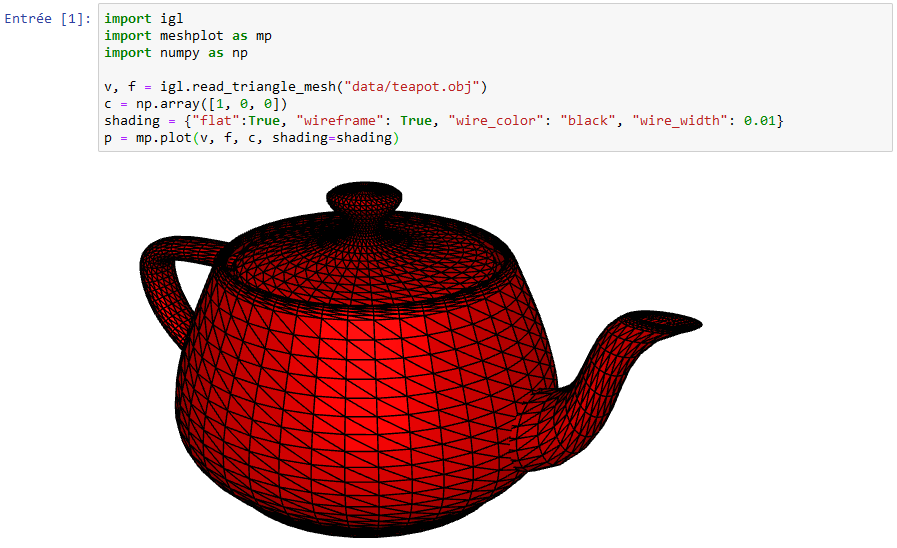

# Anaconda & igl & open3d with docker

## Build

```sh
docker build -t anaconda_igl .
```

## Run

```sh
docker run -i -t -p 8888:8888 -v ${PWD}\:/tmp/ anaconda_igl /bin/bash -c "/opt/conda/bin/jupyter notebook --notebook-dir=/tmp/ --ip='0.0.0.0' --port=8888 --no-browser --allow-root --NotebookApp.token=toto"
```

## Test

- Run container
- Go to http://localhost:8888
- Open a new Python 3 notebook
- Execute the following code :
```python
import igl
import meshplot as mp
import numpy as np

v, f = igl.read_triangle_mesh("data/teapot.obj")
c = np.array([1, 0, 0])
shading = {"flat":True, "wireframe": True, "wire_color": "black", "wire_width": 0.01}
p = mp.plot(v, f, c, shading=shading)
```



```
import numpy as np
import open3d as o3d
import meshplot as mp

mesh = o3d.io.read_triangle_mesh("data/teapot.obj")
f = np.asarray(mesh.triangles)
v = np.asarray(mesh.vertices)
c = (1.0, 0.0, 0.0)

shading = {"flat":True, "wireframe": True, "wire_color": "black", "wire_width": 0.01}
p = mp.plot(v, f, c, shading=shading)
```

## References

- anaconda : https://www.anaconda.com/
- libigl : https://github.com/libigl/libigl/
- https://geometryprocessing.github.io/geometric-computing-python/viz_basic/
- meshplot : https://skoch9.github.io/meshplot/
- open3d : http://www.open3d.org/
- visualization with open3d : https://colab.research.google.com/drive/1CR_HDvJ2AnjJV3Bf5vwP70K0hx3RcdMb
